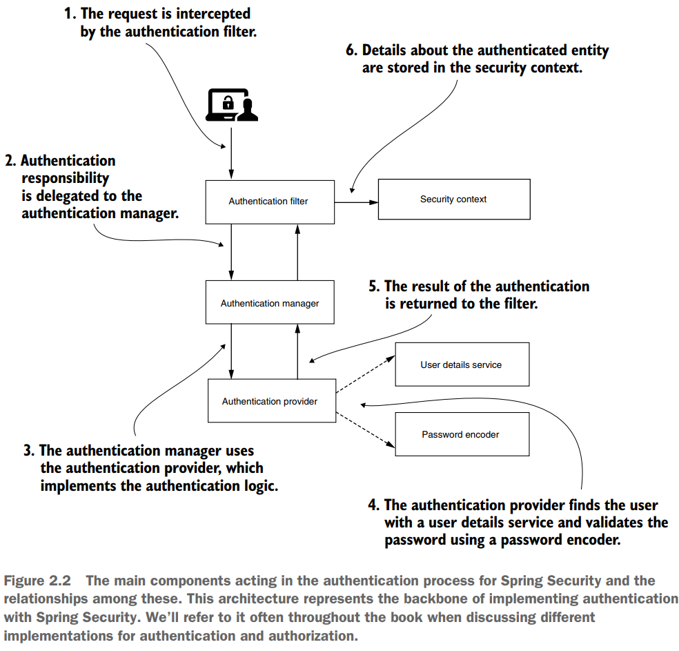
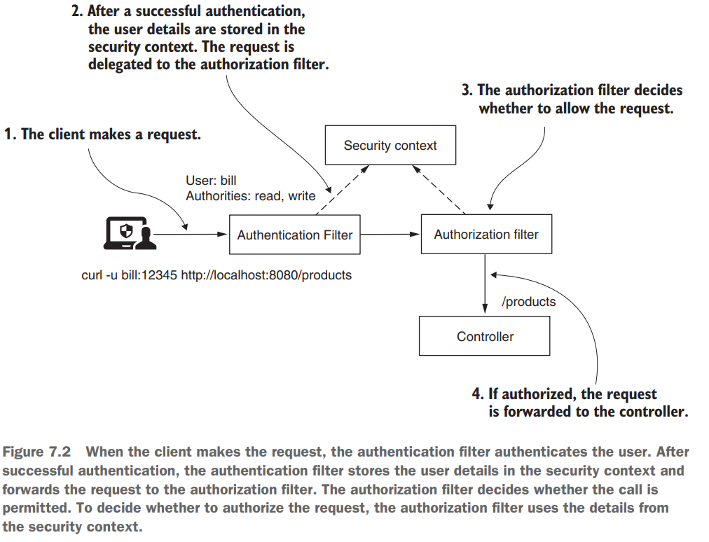

# Spring Security y JWT - Proyecto plantilla

Este proyecto lo realizaré como una plantilla para poder reutilizarlo en futuros proyectos que requieran usar JWT como
medio de autenticación. Es decir, crearé una carpeta **security** que contendrá toda la configuración de seguridad, a
fin de solo copiar y pegar esta carpeta en el nuevo proyecto.
---

# Capa de Negocio

Para poder utilizar Spring Security necesitamos "algo" a lo que le daremos seguridad. Ese algo será nuestra aplicación
de negocio, donde expondremos ciertos endpoints (un crud básico) que más adelante, según el authority del usuario
podrán ser accedidos.

## Dependencias

Para la construcción de la aplicación de negocio usaremos las siguientes dependencias:

````xml

<dependencies>
    <dependency>
        <groupId>org.springframework.boot</groupId>
        <artifactId>spring-boot-starter-data-jpa</artifactId>
    </dependency>
    <dependency>
        <groupId>org.springframework.boot</groupId>
        <artifactId>spring-boot-starter-web</artifactId>
    </dependency>

    <dependency>
        <groupId>com.mysql</groupId>
        <artifactId>mysql-connector-j</artifactId>
        <scope>runtime</scope>
    </dependency>
    <dependency>
        <groupId>org.springframework.boot</groupId>
        <artifactId>spring-boot-starter-test</artifactId>
        <scope>test</scope>
    </dependency>
</dependencies>
````

Recordar que estamos trabajando con ``java 17 y Spring Boot 3.1.1``.

## Configurando DataSource

Nuestro **application.properties** tendrá las siguientes configuraciones:

````properties
# Datasource
spring.datasource.url=jdbc:mysql://localhost:3306/db_spring_security_jwt_template_project?serverTimezone=America/Lima
spring.datasource.username=root
spring.datasource.password=magadiflo
spring.datasource.driver-class-name=com.mysql.cj.jdbc.Driver
# Jpa
spring.jpa.hibernate.ddl-auto=create-drop
spring.jpa.show-sql=true
spring.jpa.properties.hibernate.format_sql=true
spring.jpa.database=mysql
spring.jpa.properties.hibernate.dialect=org.hibernate.dialect.MySQLDialect
````

## Entidad del negocio

Crearemos una entidad **Product** para el que crearemos su crud:

````java

@Entity
@Table(name = "products")
public class Product {
    @Id
    @GeneratedValue(strategy = GenerationType.IDENTITY)
    private Long id;
    private String name;
    private Double price;

    /* omitted setters, getters and toString() method */
}
````

## Repositorio de la entidad del negocio

````java
public interface ProductRepository extends JpaRepository<Product, Long> {
}
````

## Capa de servicio

Crearemos una interfaz por buenas prácticas y la implementación del mismo:

````java
public interface ProductService {
    List<Product> findAllProducts();

    Optional<Product> findProductById(Long id);

    Product saveProduct(Product product);

    Optional<Product> updateProduct(Long id, Product product);

    Optional<Boolean> deleteProduct(Long id);
}
````

Hacemos inyección de dependencia de nuestro repositorio para poder hacer las operaciones hacia la base de datos.

````java

@Service
public class ProductServiceImpl implements ProductService {

    private final ProductRepository productRepository;

    public ProductServiceImpl(ProductRepository productRepository) {
        this.productRepository = productRepository;
    }

    @Override
    @Transactional(readOnly = true)
    public List<Product> findAllProducts() {
        return this.productRepository.findAll();
    }

    @Override
    @Transactional(readOnly = true)
    public Optional<Product> findProductById(Long id) {
        return this.productRepository.findById(id);
    }

    @Override
    @Transactional
    public Product saveProduct(Product product) {
        return this.productRepository.save(product);
    }

    @Override
    @Transactional
    public Optional<Product> updateProduct(Long id, Product product) {
        return this.productRepository.findById(id)
                .map(productDB -> {
                    productDB.setName(product.getName());
                    productDB.setPrice(product.getPrice());
                    return this.productRepository.save(productDB);
                });
    }

    @Override
    @Transactional
    public Optional<Boolean> deleteProduct(Long id) {
        return this.productRepository.findById(id)
                .map(productDB -> {
                    this.productRepository.deleteById(productDB.getId());
                    return true;
                });
    }
}
````

## Rest Controller Product

Los endpoints que exponen las operaciones CRUD. Hacemos inyección de dependencia de nuestra capa de servicio.

````java

@RestController
@RequestMapping(path = "/api/v1/products")
public class ProductController {
    private final ProductService productService;

    public ProductController(ProductService productService) {
        this.productService = productService;
    }

    @GetMapping
    public ResponseEntity<List<Product>> getAllProducts() {
        return ResponseEntity.ok(this.productService.findAllProducts());
    }

    @GetMapping(path = "/{id}")
    public ResponseEntity<Product> getProduct(@PathVariable Long id) {
        return this.productService.findProductById(id)
                .map(ResponseEntity::ok)
                .orElseGet(() -> ResponseEntity.notFound().build());
    }

    @PostMapping
    public ResponseEntity<Product> saveProduct(@RequestBody Product product) {
        Product productDB = this.productService.saveProduct(product);
        URI productURI = URI.create("/api/v1/products/" + productDB.getId());
        return ResponseEntity.created(productURI).body(productDB);
    }

    @PutMapping(path = "/{id}")
    public ResponseEntity<Product> updateProduct(@PathVariable Long id, @RequestBody Product product) {
        return this.productService.updateProduct(id, product)
                .map(ResponseEntity::ok)
                .orElseGet(() -> ResponseEntity.notFound().build());
    }

    @DeleteMapping(path = "/{id}")
    public ResponseEntity<?> deleteProduct(@PathVariable Long id) {
        return this.productService.deleteProduct(id)
                .map(isRemoved -> ResponseEntity.noContent().build())
                .orElseGet(() -> ResponseEntity.notFound().build());
    }
}
````

## Probando endpoints

Se muestran los 5 endpoints expuestos por nuestra API. Aquí hacemos pruebas **sin tener Spring Security.**

### Listar todos los productos

````bash
curl -i http://localhost:8080/api/v1/products
HTTP/1.1 200
Content-Type: application/json
Transfer-Encoding: chunked
Date: Tue, 27 Jun 2023 15:55:45 GMT

[
  {"id":1,"name":"Pc gamer","price":3500.0},
  {"id":2,"name":"Teclado inalámbrico","price":150.8},
  {"id":3,"name":"Mouse inalámbrico","price":99.9},
  {"id":4,"name":"Celular Samsung A7","price":5900.0}
]
````

### Ver un producto

Producto existente con id = 3:

````bash
curl -i http://localhost:8080/api/v1/products/3
HTTP/1.1 200
Content-Type: application/json
Transfer-Encoding: chunked
Date: Tue, 27 Jun 2023 15:57:30 GMT

{"id":3,"name":"Mouse inalámbrico","price":99.9}
````

Producto no existente con id = 50

````bash
curl -i http://localhost:8080/api/v1/products/50
HTTP/1.1 404
Content-Length: 0
Date: Tue, 27 Jun 2023 16:04:16 GMT
````

### Guardar un producto

````bash
curl -i -X POST -H "Content-Type: application/json" -d "{\"name\": \"Monitor LG 27'\", \"price\": 780.50}" http://localhost:8080/api/v1/products
HTTP/1.1 201
Location: /api/v1/products/5
Content-Type: application/json
Transfer-Encoding: chunked
Date: Tue, 27 Jun 2023 15:59:40 GMT

{"id":5,"name":"Monitor LG 27'","price":780.5}
````

### Actualizar un producto

Actualizar producto existente con id = 5:

````bash
curl -i -X PUT -H "Content-Type: application/json" -d "{\"name\": \"Monitor LG 32' Ultra HD\", \"price\": 1200.00}" http://localhost:8080/api/v1/products/5
HTTP/1.1 200
Content-Type: application/json
Transfer-Encoding: chunked
Date: Tue, 27 Jun 2023 16:01:54 GMT

{"id":5,"name":"Monitor LG 32' Ultra HD","price":1200.0}
````

Actualizar producto no existente con id = 60:

````bash
curl -i -X PUT -H "Content-Type: application/json" -d "{\"name\": \"Parlantes chicos\", \"price\": 48}" http://localhost:8080/api/v1/products/60
HTTP/1.1 404
Content-Length: 0
Date: Tue, 27 Jun 2023 16:07:07 GMT
````

### Eliminar un producto

Eliminando producto existente con id = 5:

````bash
curl -i -X DELETE http://localhost:8080/api/v1/products/5
HTTP/1.1 204
Date: Tue, 27 Jun 2023 16:03:05 GMT
````

Eliminando producto no existente con id = 74:

````bash
curl -i -X DELETE http://localhost:8080/api/v1/products/74
HTTP/1.1 404
Content-Length: 0
Date: Tue, 27 Jun 2023 16:07:49 GMT
````

---

# Spring Security con JWT

A partir de esta sección iniciamos el desarrollo del proyecto como plantilla usando JWT con Spring Security.

## Nuevas dependencias

Existen muchas librerías que nos ayudan a crear, firmar, verificar, etc. un JWT. Vi en muchos
tutoriales que he realizado, el uso de dos de ellas con mayor frecuencia: [**jwtk/jjwt**](https://github.com/jwtk/jjwt)
y el [**auth0/java-jwt**](https://github.com/auth0/java-jwt). En nuestro caso, optaré por usar la segunda librería
**(auth0/java-jwt),** ya que según lo investigado es más robusto que el otro que es un poco más liviano.

````xml

<dependencies>
    <!--Dependencias para Spring Security-->
    <dependency>
        <groupId>org.springframework.boot</groupId>
        <artifactId>spring-boot-starter-security</artifactId>
    </dependency>
    <dependency>
        <groupId>org.springframework.security</groupId>
        <artifactId>spring-security-test</artifactId>
        <scope>test</scope>
    </dependency>

    <!--Dependencia de auth0/java-jwt para trabajar con JWT-->
    <dependency>
        <groupId>com.auth0</groupId>
        <artifactId>java-jwt</artifactId>
        <version>4.4.0</version>
    </dependency>
</dependencies>
````

## Comportamiento por defecto

Tan solo agregando la dependencia de **Spring Security**, basta para tener nuestra aplicación asegurada por defecto. Es
decir, para poder acceder a algún endpoint, necesito autenticarme. Por defecto, Spring Security agrega el
**Http Basic Authentication** y el **Form Login Authentication**, esto significa que, al acceder con **curl** o
**postman** se hará uso del **Http Basic Authentication**, mientras que si accedemos usando un navegador web, se
activará el filtro de **Form Login Authentication**.

A continuación se muestran los ejemplos:

Accediendo a la lista de productos usando curl. Tenemos que agregar el usuario **user** y la contraseña generada de
aleatoriamente en la consola:

````bash
curl -i -u user:01f90fdc-9566-4694-a3cc-cd8a2855f0f2 http://localhost:8080/api/v1/products
HTTP/1.1 200
X-Content-Type-Options: nosniff
X-XSS-Protection: 0
Cache-Control: no-cache, no-store, max-age=0, must-revalidate
Pragma: no-cache
Expires: 0
X-Frame-Options: DENY
Content-Type: application/json
Transfer-Encoding: chunked
Date: Tue, 27 Jun 2023 21:47:20 GMT

[ 
  {"id":1,"name":"Pc gamer","price":3500.0},
  {"id":2,"name":"Teclado inalámbrico","price":150.8},
  {"id":3,"name":"Mouse inalámbrico","price":99.9},
  {"id":4,"name":"Celular Samsung A7","price":5900.0}
]
````

Accediendo a la lista de productos usando el navegador web. Al hacerlo veremos que nos redireccionará a un formulario
de Login para poder ingresar el usuario **user** y la contraseña generada aleatoriamente en la consola. Luego de
ingresar las credenciales e iniciar sesión, nos redirecciona a la ruta que solicitamos inicialmente:

````
http://localhost:8080/api/v1/products?continue
````

````json
[
  {
    "id": 1,
    "name": "Pc gamer",
    "price": 3500
  },
  {
    "id": 2,
    "name": "Teclado inalámbrico",
    "price": 150.8
  },
  {
    "id": 3,
    "name": "Mouse inalámbrico",
    "price": 99.9
  },
  {
    "id": 4,
    "name": "Celular Samsung A7",
    "price": 5900
  }
]
````

## Componentes principales que actúan en el proceso de Autenticación y Authorización en Spring Security

A modo de repaso general, es importante tener conocimiento del siguiente esquema donde muestra los componentes
principales que actúan en el proceso de autenticación en Spring Security obtenido del libro de
[**Spring Security In Action 2020**](https://github.com/magadiflo/spring-security-in-action-2020.git)



Después de una autenticación exitosa, el **Authentication Filter** almacena los detalles del usuario en el **Security
context** y reenvía la solicitud al **Authorization Filter**. El filtro de autorización decide si se permite la llamada.
Para decidir si autorizar la solicitud, el **Authorization Filter** utiliza los detalles del contexto de seguridad.



Las imágenes mostradas anteriormente serán tomadas como referencia al momento de ir construyendo el proyecto de
seguridad con JWT.

## Creando la Entity User

Creamos nuestra entidad **User** que será la que mapearemos con la tabla **users** de la base de datos.

````java

@Entity
@Table(name = "users")
public class User {
    @Id
    @GeneratedValue(strategy = GenerationType.IDENTITY)
    private Long id;
    private String firstName;
    private String lastName;
    private String username;
    private String password;
    @Enumerated(EnumType.STRING)
    private Role role;

    /* omitted setters and getters */
}
````

El rol y las authorities dependerán de la lógica de negocio al que se esté aplicando. Así pues, en este proyecto
**trabajaremos solo con roles**, en tal sentido, un usuario tendrá asignado un único rol.

````java
public enum Role {
    USER, ADMIN, SUPER_ADMIN
}
````

**NOTA**
> Recordar que roles y authorities son dos cosas distintas. Digamos que Roles es más amplio y contienen authorities.
> Además, a los authorities se les conoce como permisos. En ese sentido, un rol puede tener muchos authorities o
> permisos.

## Repositorio para User

Creamos el repositorio de User para hacer consultas a la base de datos. Además, definimos un método personalizado que
nos retornará un User en función de su username:

````java
public interface UserRepository extends JpaRepository<User, Long> {
    Optional<User> findUserByUsername(String username);
}
````

